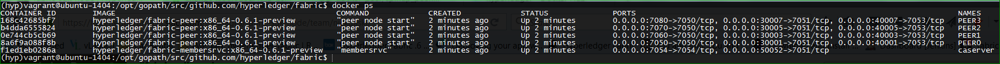

# Spinup Local Peer Network
Purpose of this script is to **spinup "n" number of peers** on docker environment. This script pulls fabric-baseimage, peer and membersrvc images from [Hyperledger Docker hub account](https://hub.docker.com/u/hyperledger/) based on the ARCH value and tag number provided while executing script.

## What this script does for you?

For quick testing or development work, follow the execution commands to launch peer netowork. User host system should have docker environment up and running. Script does below tasks before it gives you network.

   * Download base, peer and membersrvc images
   * Fetches the docker interface port (2375)
   * Fetches user/client credentials from membersrvc.yaml file
   * Spinsup number of peers specified
   * Generate container log files for each container. In the current working directory display log file names as LOGFILE_CONTAINER_ID
   * Generate network credential file to store peer network details and user credentials for quick testing.

Note: If the docker interface port (2375) is not assigned/configured properly, execute script using "sudo" to setup DOCKER_OPTS in /etc/defaults/docker file.

## USAGE:

```
./spinup_peer_network.sh -n <number of peers, N> -s <security and privacy enabled) -c <specify the tag number> -l <Logging level> -m <consensus Mode> -f <number of faulty peers, F> -b <batch size> -t <TLS enabled/disabled (y/n)>

OPTIONS:

-h/? - Print a usage message
-n   - Number of peers to launch (Default is 4)
-s   - Enable Security and Privacy, and start memberservices (caserver)
-c   - Provide Specific peer and membersrvc docker image commit (default is latest)
-l   - Select logging method detail level (Default is debug)
-m   - Select consensus mode (Default is pbft)
-f   - Number of faulty peers allowed in a pbft network (default is max possible value (N-1)/3)
-b   - batch size (Default is 500)
-t   - Enable TLS (default is disabled)
 Example: 
./spinup_peer_network.sh -n 4 -s -c x86_64-0.6.1-preview -l debug -m pbft -t y
```

Before execute **spinup_peer_network.sh** script, make sure the host system satisfies the below requirements.

1. Make sure docker is installed if not, Install and configure docker from here https://github.com/hyperledger/fabric/blob/master/devenv/setup.sh

2. If applicable, verify ufw firewall status in non-vagrant environment. Disable firewall if it is enabled.

   `sudo ufw status`
  
   `sudo ufw disable`
  
3. Clear `iptables` rules (if firewall rules are rejecting docker requests) and re-start docker daemon.

   `iptables -L` (to view iptable rules)
   
   `iptables -D INPUT 4` (ex: to delete Reject rules from INPUT policy. 4 is the row number to delete)
 
4. If you do not want to build images manually, skip this step and simply take the image name and specific tag from above mentioned docker hub account. If you wish to build peer and membersrvc images natively and provide the image name and tag number in spinup_peer_network.sh script. Move to directory where the makefile is located (root of the fabric directory)
   
   `cd $GOPATH/src/github.com/hyperledger/fabric`
   `make images`

5. curl the below script and execute peer script to spinup "n" number of peers of your choice.

   `curl -L https://raw.githubusercontent.com/hyperledger/fabric/scripts/spinup_peer_network.sh -o spinup_peer_network.sh`
   
   `chmod +x spinup_peer_network.sh`
   
   `./spinup_peer_network.sh -n 4 -s -c x86_64-0.6.1-preview -l debug -m pbft -t y`

**Note:** If you don't sepecify the commit number, script executes with default values provided in the script. To launch peers with specific tag, please look into the tags for each image in hyperledger docker hub account. https://hub.docker.com/u/hyperledger/

**Reference:**



## Useful Docker Commands:

1. Kill all containers
  - **docker rm $(docker ps -aq))** (user rm -f to force kill)
2. Remove all exited containers
  - **docker ps -aq -f status=exited | xargs docker rm**
3. Remove all Images except 'hyperledger/fabric-baseimage'
  - **docker rmi $(docker images | grep -v 'hyperledger/fabric-baseimage:latest' | awk {'print $3'})**
4. Stop Docker container
  - **docker stop Container ID**
5. Start Docker container
  - **docker start Container ID**
6. To know running containers
  - **docker ps**
7. To know all containers (Including active and non-active)
  - **docker ps -a**
9. To view NetworkSettings of a Container
  - **docker inspect Container ID**
10. To View Logs of a Container
  - **docker logs -f Container ID**

## Testing Chaincode in CLI mode:

Execute `docker exec -it PEER0 bash` command to get into PEER0 docker container and execute below commands to **Register** an user, **Deploy** chaincode, **Invoke** and **Query** transactions from PEER0 docker container CLI.

### Registering user inside PEER0 container:

`peer network login test_user0` or `peer network login test_user0 -p MS9qrN8hFjlE`

```
root@7efbae933829:/opt/gopath/src/github.com/hyperledger/fabric# peer network login test_user0
2016/07/23 00:51:09 Load docker HostConfig: %+v &{[] [] []  [] false map[] [] false [] [] [] [] host    { 0} [] { map[]} false []  0 0 0 false 0    0 0 0 []}
00:51:09.492 [crypto] main -> INFO 002 Log level recognized 'info', set to INFO
00:51:09.493 [main] networkLogin -> INFO 003 CLI client login...
00:51:09.493 [main] networkLogin -> INFO 004 Local data store for client loginToken: /var/hyperledger/production/client/
Enter password for user 'test_user0': ************
00:51:14.863 [main] networkLogin -> INFO 005 Logging in user 'test_user0' on CLI interface...
00:51:15.374 [main] networkLogin -> INFO 006 Storing login token for user 'test_user0'.
00:51:15.374 [main] networkLogin -> INFO 007 Login successful for user 'test_user0'.
00:51:15.374 [main] main -> INFO 008 Exiting.....
```

### Deploy Chaincode:

Once user is registered, execute the below command to deploy chaincode on PEER0. Below command is to deploy chaincode on PEER0 where peer is running with security & privacy enabled.

```
peer chaincode deploy -u test_user0 -p github.com/hyperledger/fabric/examples/chaincode/go/chaincode_example02 -c '{"Args": ["init","a", "100", "b", "200"]}'
```
After deploy is successfully executed it creates a chaincode ID.
```
ee5b24a1f17c356dd5f6e37307922e39ddba12e5d2e203ed93401d7d05eb0dd194fb9070549c5dc31eb63f4e654dbd5a1d86cbb30c48e3ab1812590cd0f78539
```
### Invoke Chaincode:

Submit Invoke transaction using the above chaincode ID:

```
peer chaincode invoke -u test_user0 -n ee5b24a1f17c356dd5f6e37307922e39ddba12e5d2e203ed93401d7d05eb0dd194fb9070549c5dc31eb63f4e654dbd5a1d86cbb30c48e3ab1812590cd0f78539 -c '{"Args": ["invoke", "a", "b", "10"]}'
```
### Query Chaincode:

Submit Query Transaction using chaincode

```
peer chaincode query -u test_user0 -n ee5b24a1f17c356dd5f6e37307922e39ddba12e5d2e203ed93401d7d05eb0dd194fb9070549c5dc31eb63f4e654dbd5a1d86cbb30c48e3ab1812590cd0f78539 -c '{"Args": ["query", "a"]}'
```

You can also send REST requests from any REST based tools to any of the peers launched above.
